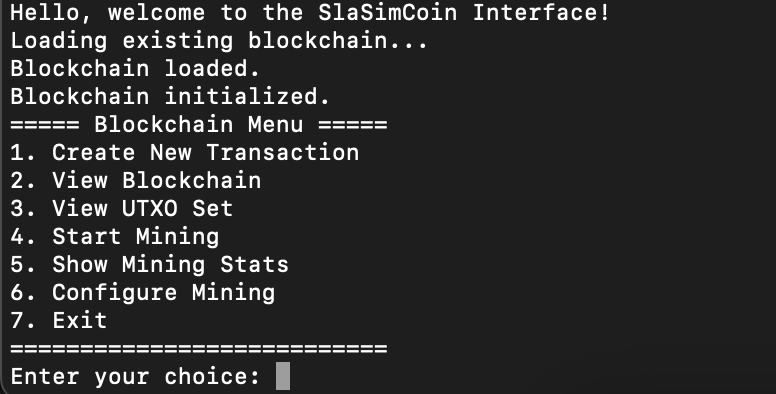
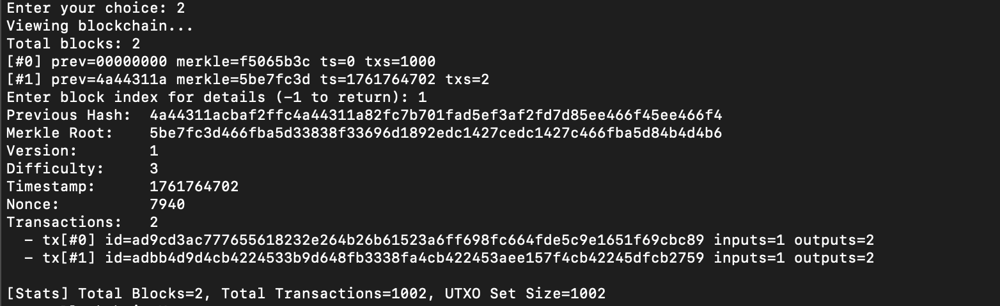
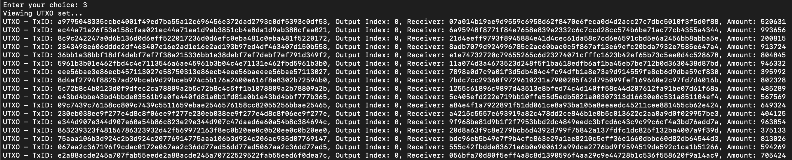
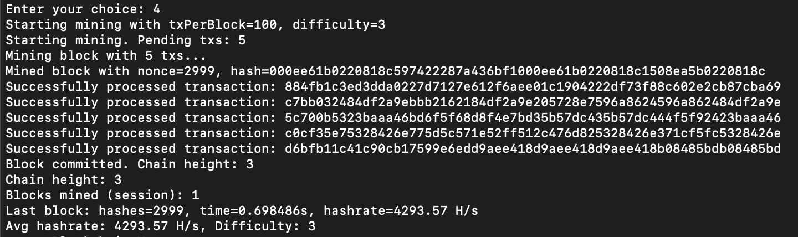
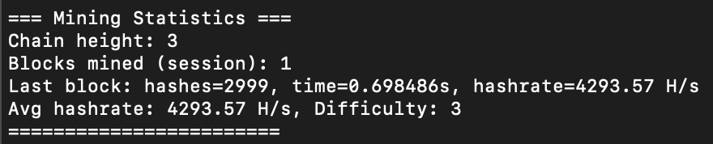
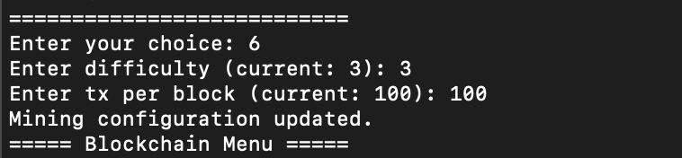

# SlaSimCoin — Educational Blockchain + PoW Miner

SlaSimCoin is a compact, educational blockchain showcasing:
- User and transaction generation
- UTXO-based state management
- Proof-of-Work mining (000… leading zeros)
- Block formation, persistence, and a simple console UI

This project is NOT production-grade nor cryptographically secure. It is designed to demonstrate core concepts clearly.

## Table of Contents
- Overview
- Features
- Project Layout
- Build and Run
- Usage (Console UI)
- Implementation Details
- Code Snippets (quick starts)
- Data Files
- Troubleshooting
- Roadmap / Reach Goals

## Overview
You can generate users and transactions, mine blocks with PoW, update the UTXO set, and explore the chain through a terminal menu. Mining difficulty and transactions per block can be configured at runtime.

## Features
- Transaction queue with JSON persistence
- Block mining with nonce iteration and difficulty target (leading zeros)
- UTXO validation and updates on block confirmation
- Chain validation and chaining (`previous_block_hash`)
- JSON persistence for blockchain and UTXO set
- Simple UI to generate transactions, mine, and inspect blocks

## Project Layout
```
source/
  block/
    block.h|cpp            # Block model, PoW, Merkle root, JSON
    blockchain.h|cpp       # In-memory chain logic and chaining validation
    block_storage.h|cpp    # Persist/Load blockchain (JSON)
  transaction/
    transaction.h|cpp      # Transaction model + (de)serialization
    transaction_queue.h|cpp# Random selection, persistence
  utxo/
    UTXO.h|cpp             # UTXO model
    UTXO_set.h|cpp         # UTXO singleton, validation, processing
  mining/
    mining_manager.h|cpp   # Main mining loop, stats, persistence integration
  hash_function.h|cpp      # SlaSimHash (educational)
helpers/
  generate_users.*         # Generates 1k users
  generate_transactions.*  # Generates transactions JSON
  genesis_block_creation.* # Genesis block creation
ui/
  menu.h|cpp               # Console interface
data/
  users.txt                # Generated users
  utxo_set.json            # UTXO persistence
  blockchain.json          # Blockchain persistence
  transaction_queue.json   # Pending transactions
```

## Build and Run

### Requirements
- C++17 compatible compiler (g++ or clang++)
- OpenMP support (for parallel mining)

### Linux / Standard Unix Systems

```bash
make
./main
```

### macOS

macOS requires OpenMP to be installed via Homebrew first:

```bash
# Install OpenMP library
brew install libomp

# Build using the macOS-specific makefile
make -f makefile.macos

# Run
./main
```

**Note:** The standard `makefile` uses `-fopenmp` which is not supported by clang on macOS. Use `makefile.macos` instead, which uses the Homebrew-installed OpenMP library.

If `./data` files are missing, the app will generate users and a genesis block on first run.

## Usage (Console UI)
When the app starts you’ll see:
1. Create New Transaction
2. View Blockchain
3. View UTXO Set
4. Start Mining
5. Show Mining Stats
6. Configure Mining (difficulty, tx-per-block)
7. Exit

Typical flow:
1) Choose 6 to set difficulty (e.g., 3) and transactions per block (e.g., 100)
2) Choose 1 to add more transactions (optional)
3) Choose 4 to mine blocks
4) Choose 5 to view mining statistics
5) Choose 2 to explore blocks and transactions

## Implementation Details

### Proof-of-Work

The blockchain uses a simplified Proof-of-Work (PoW) consensus mechanism where miners must find a nonce that produces a block hash with a specified number of leading zeros.

**Block Header Format**: The block header is constructed by concatenating:
- `previous_block_hash` (64 hex chars)
- `merkle_root_hash` (64 hex chars)
- `version` (integer)
- `difficulty` (integer)
- `timestamp` (long)
- `nonce` (long)

This header string is then hashed using `SlaSimHash`. A block is valid if the resulting hash string starts with N zeros, where N is the difficulty level.

**Mining Process**: The miner iteratively increments the nonce starting from 0, recomputes the hash, and checks if it meets the difficulty target. This continues until a valid hash is found or the mining process is aborted.

**Design Choice**: We use leading zeros instead of comparing against a target value for simplicity and educational clarity. This makes it easy to visually verify block validity (e.g., `000abc123...` clearly shows 3 leading zeros).

```cpp
// Block header serialization and hashing
std::string header = previousHash + merkle + std::to_string(version) 
                   + std::to_string(difficulty) + std::to_string(timestamp) 
                   + std::to_string(nonce);
std::string hash = SlaSimHash(header);

// Check if hash meets difficulty requirement
if (Block::hasLeadingZeros(hash, difficulty)) {
    // Block is valid!
}
```

### Block Structure and Chaining

Each block contains:
- **Header**: `previous_block_hash`, `merkle_root_hash`, `version`, `difficulty`, `timestamp`, `nonce`
- **Body**: Vector of transactions

**Chain Integrity**: Blocks are linked via `previous_block_hash`. Each block (except genesis) must reference the hash of the immediately preceding block. This creates an immutable chain: changing any block would invalidate all subsequent blocks.

**Validation**: When adding a new block, the system verifies that:
1. The new block's `previous_block_hash` matches the hash of the current latest block
2. The block meets the PoW difficulty requirement

**Design Choice**: Using `previous_block_hash` ensures immutability and makes it easy to detect tampering. If any block is modified, its hash changes, breaking the chain for all subsequent blocks.

```cpp
// Verify block chaining
bool Blockchain::isChained(const Block& prev, const Block& next) {
    std::string prevHash = computeBlockHash(prev);
    return next.getPreviousBlockHash() == prevHash;
}

bool Blockchain::addBlock(const Block& block) {
    if (!blocks.empty()) {
        const Block& prev = blocks.back();
        if (!isChained(prev, block)) {
            return false; // Chain broken!
        }
    }
    blocks.push_back(block);
    return true;
}
```

### Merkle Root Computation

The Merkle root is a single hash representing all transactions in a block, computed using a binary tree structure.

**Algorithm**:
1. Hash each transaction to create the leaf layer
2. Pair adjacent hashes and hash their concatenation to create the next layer
3. If a layer has an odd number of items, duplicate the last item
4. Repeat until a single root hash remains

**Design Choice**: Merkle trees enable efficient transaction verification. To verify a transaction is in a block, you only need to check a logarithmic path (O(log n)) rather than all transactions. This also allows lightweight clients to verify transactions without downloading entire blocks.

```cpp
std::string Block::computeMerkleRoot(const std::vector<Transaction>& transactions) {
    if (transactions.empty()) return std::string(64, '0');
    
    std::vector<std::string> layer;
    for (const auto& tx : transactions) {
        layer.push_back(tx.computeTransactionHash());
    }
    
    while (layer.size() > 1) {
        if (layer.size() % 2 != 0) {
            layer.push_back(layer.back()); // Duplicate last for odd count
        }
        
        std::vector<std::string> new_layer;
        for (int i = 0; i < layer.size(); i += 2) {
            std::string combined = layer[i] + layer[i + 1];
            new_layer.push_back(SlaSimHash(combined));
        }
        layer = new_layer;
    }
    
    return layer.front();
}
```

### UTXO Model

The blockchain uses a UTXO (Unspent Transaction Output) model to represent state. Instead of tracking account balances, the system maintains a set of unspent outputs that can be used as inputs in future transactions.

**UTXO Structure**: Each UTXO represents:
- `transaction_id`: The transaction that created this output
- `output_index`: The index of the output within that transaction
- `receiver_public_key`: The owner of this UTXO
- `amount`: The value in coins

**State Representation**: The UTXO set is the canonical representation of who owns what. When a transaction is processed:
- Input UTXOs are removed (spent)
- Output UTXOs are added (created)

**Design Choice**: UTXO model was chosen over account-based for educational clarity. It makes ownership explicit (each coin has a clear owner) and transaction flow obvious (inputs → outputs). It also simplifies parallel processing since each UTXO is independent.

```cpp
// UTXO set maintains unspent outputs
class UTXOSet {
    std::unordered_set<UTXO> utxos;
    
    void processTransaction(const Transaction& tx) {
        spendUTXOs(tx.getInputs());      // Remove spent inputs
        addTransactionOutputs(tx.getTransactionId(), tx.getOutputs()); // Add new outputs
    }
};
```

### Transaction Validation

Every transaction must pass multiple validation checks before being accepted into a block:

1. **Input Validation**: All inputs must reference existing, unspent UTXOs
2. **Output Validation**: All outputs must have positive amounts and valid receiver addresses
3. **Balance Check**: Sum of input amounts ≥ sum of output amounts (excess becomes implicit fee)
4. **Signature Verification**: Each input must be signed by the owner of the referenced UTXO

**Signature Format**: For educational purposes, we use a simplified signature scheme. The signature is computed as:
```
signature = SlaSimHash(transaction_id + output_index + private_key)
```

**Design Choice**: We simplified cryptographic signatures to focus on blockchain mechanics rather than cryptographic complexity. In production, you'd use proper digital signatures (e.g., ECDSA), but our approach demonstrates the concept while keeping the code readable.

```cpp
bool UTXOSet::validateTransaction(const Transaction& tx) const {
    // Check all inputs reference existing UTXOs
    if (!hasAllInputsConfirmed(tx)) return false;
    
    // Verify outputs are valid
    if (!tx.validateOutputs()) return false;
    
    // Check input sum >= output sum
    double input_amount = tx.getTotalInputAmount(available_utxos);
    double output_amount = tx.getTotalOutputAmount();
    if (input_amount < output_amount) return false;
    
    // Verify signatures
    if (!tx.hasValidSignature(available_utxos)) return false;
    
    return true;
}
```

### Coinbase Transactions

Each mined block includes a special coinbase transaction as its first transaction. This transaction creates new coins as a mining reward.

**Synthetic Input**: Coinbase transactions have a special synthetic input:
- `previous_transaction_id = "COINBASE"`
- `output_index = -1`
- `signature = ""` (empty)

This input doesn't reference any real UTXO and serves as a marker indicating the transaction creates coins from nothing.

**Block Reward**: Currently fixed at 50.0 coins per block, paid to a randomly selected user from `users.txt`. This is a design choice for our mock blockchain—in a real system, the reward would go to the miner's address.

**Validation Exemption**: Coinbase transactions bypass normal validation:
- No input UTXO checks (synthetic input doesn't exist)
- No signature verification (empty signature)
- Only output validation is performed (amounts must be positive)

**Design Choice**: Random user selection keeps the mock blockchain simple. In production, miners would specify their own addresses. We also allow mining blocks with zero user transactions (coinbase-only blocks) to demonstrate that blocks can exist without user transactions.

```cpp
// Create coinbase transaction
Transaction Transaction::createCoinbaseTransaction(const std::string& receiver, double amount) {
    std::vector<TransactionInputs> inputs;
    inputs.push_back(TransactionInputs("COINBASE", -1, "")); // Synthetic input
    
    std::vector<TransactionOutputs> outputs;
    outputs.push_back(TransactionOutputs(receiver, amount));
    
    std::string txid = SlaSimHash("COINBASE" + std::to_string(-1) + receiver + std::to_string(amount));
    return Transaction(txid, inputs, outputs);
}

// Coinbase validation exemption
bool UTXOSet::validateTransaction(const Transaction& tx) const {
    if (tx.isCoinbase()) {
        return tx.isValid() && tx.validateOutputs(); // Skip input/signature checks
    }
    // ... normal validation ...
}
```

### Mining Process

The mining process orchestrates transaction selection, block creation, proof-of-work computation, and state updates.

**Mining Flow**:
1. **Transaction Selection**: Randomly select transactions from the queue (10x multiplier for better selection)
2. **Validation Filtering**: Keep only transactions that pass UTXO validation
3. **Coinbase Creation**: Create a coinbase transaction paying 50.0 coins to a random user
4. **Block Construction**: Create block with coinbase first, then user transactions
5. **Mining Loop**: Iterate nonce until hash meets difficulty target
6. **State Update**: Process all transactions (spend inputs, create outputs)
7. **Chain Append**: Add block to chain (validates chaining)
8. **Persistence**: Save blockchain, UTXO set, and remove mined transactions from queue

**Mining Statistics**: Tracks hashrate (hashes per second), average hashrate, and total blocks mined in the current session.

**Design Choice**: We allow mining even when there are zero user transactions. This means blocks can contain only the coinbase transaction, demonstrating that blocks don't require user activity to be valid. The transaction selection uses a multiplier to increase the chance of finding valid transactions.

```cpp
int MiningManager::mineAndCommitBlock(const std::vector<Transaction>& userTxs, ...) {
    // Create coinbase transaction
    const double BLOCK_REWARD = 50.0;
    std::string minerAddress = getRandomUserPublicKey();
    Transaction coinbase = Transaction::createCoinbaseTransaction(minerAddress, BLOCK_REWARD);
    
    // Prepend coinbase (must be first)
    std::vector<Transaction> allTransactions;
    allTransactions.push_back(coinbase);
    allTransactions.insert(allTransactions.end(), userTxs.begin(), userTxs.end());
    
    // Create and mine block
    Block block(previousHash, merkle, version, difficulty, timestamp, 0, allTransactions);
    
    // Mining loop
    while (true) {
        ++nonce;
        block.setNonce(nonce);
        std::string hash = computeHash(block);
        if (Block::hasLeadingZeros(hash, difficulty)) {
            break; // Found valid block!
        }
    }
    
    // Process transactions and persist
    for (const Transaction& tx : allTransactions) {
        utxo->processTransaction(tx);
    }
    chain.addBlock(block);
    storage.save(chain.getBlocks());
}
```

### Storage and Persistence

The blockchain state is persisted to JSON files for simplicity and readability.

**Storage Format**:
- **Blockchain**: Array of block objects in `data/blockchain.json`
- **UTXO Set**: Array of UTXO objects in `data/utxo_set.json`
- **Transaction Queue**: Array of pending transactions in `data/transaction_queue.json`

**In-Memory vs. On-Disk**: The system maintains blockchain and UTXO set in memory for fast access during mining. On disk, data is stored as JSON for human readability and easy inspection.

**Loading**: On startup, the system loads the blockchain and UTXO set from JSON files. If files don't exist, it initializes with a genesis block.

**Design Choice**: JSON was chosen over binary formats for educational purposes. It's human-readable, easy to debug, and allows manual inspection of blockchain state. The trade-off is larger file sizes and slower I/O, but for an educational blockchain this is acceptable.

```cpp
// Save blockchain to JSON
void BlockchainStorage::save(const std::vector<Block>& blocks) const {
    json j = json::array();
    for (const Block& b : blocks) {
        j.push_back(b.toJson());
    }
    std::ofstream ofs(file_path);
    ofs << j.dump(4); // Pretty print with 4-space indent
}

// Load blockchain from JSON
std::vector<Block> BlockchainStorage::load() const {
    std::ifstream ifs(file_path);
    json j;
    ifs >> j;
    
    std::vector<Block> blocks;
    if (j.is_array()) {
        for (const auto& item : j) {
            blocks.push_back(parseBlock(item));
        }
    }
    return blocks;
}
```

### Parallel Mining with Competitive Threads

The blockchain supports competitive mining where multiple miners race to find a valid block hash first. This is implemented using OpenMP threads to simulate parallel miners.

**Mining Pool Architecture**: The `MiningPool` class manages multiple `MiningManager` instances, each running in a separate thread. All miners work on the same block (same transactions, same previous hash) but search different nonce ranges.

**Race Coordination**: Miners coordinate using an atomic `winner` variable:
- Initialized to `-1` (no winner yet)
- Each miner checks if another has already won before claiming victory
- First miner to find a valid hash atomically sets the winner to their ID
- Other miners detect this and abort their mining attempts

**Thread Safety**: 
- Each miner operates on its own block instance (no shared mutable state during mining)
- Block commit uses OpenMP locks to ensure only one miner commits their block
- UTXO set updates are synchronized to prevent race conditions

**Mining Rounds**: The pool runs mining in rounds:
1. All miners start simultaneously with the same transaction set
2. Miners search nonce space in parallel (each thread iterates independently)
3. First miner to find a valid hash wins the round
4. Winner commits the block, others abort
5. Process repeats for the next block

**Design Choice**: Using OpenMP (`#pragma omp parallel for`) provides thread-level parallelism without manual thread management. The atomic winner variable ensures clean coordination—only one miner commits, others gracefully abort. This demonstrates real-world mining competition where multiple miners compete for block rewards.

```cpp
// Mining pool runs miners in parallel
void MiningPool::startMining(int txPerBlock, int maxBlocks) {
    while (mined < maxBlocks) {
        // Fresh winner for each round
        auto winner = std::make_shared<std::atomic<int>>(-1);
        
        // Run all miners concurrently using OpenMP
        #pragma omp parallel for
        for (int i = 0; i < miners.size(); ++i) {
            miners[i].startMining(txPerBlock, 1, winner, i);
        }
        
        int win = winner->load();
        if (win != -1) {
            std::cout << "Miner " << win << " won this round!" << std::endl;
        }
    }
}

// Inside miner: check for winner before claiming victory
if (Block::hasLeadingZeros(hash, difficulty)) {
    int expected = -1;
    if (winner->compare_exchange_strong(expected, minerId)) {
        // This miner won! Commit the block
        break;
    } else {
        // Another miner already won, abort
        return 0;
    }
}

// Periodic check to abort if another miner won
if (nonce % 100000 == 0) {
    if (winner->load() != -1 && winner->load() != minerId) {
        return 0; // Abort mining
    }
}
```

## Data Files
- `data/users.txt`: generated users with public keys and balances
- `data/transaction_queue.json`: pending transactions for mining
- `data/utxo_set.json`: current UTXO set
- `data/blockchain.json`: blockchain (array of blocks)

## Troubleshooting
- Repeating "Invalid choice": the app is waiting for interactive input. Run `./main` in a terminal and type a number.
- JSON error on load: older files may store a single block object. The loader supports both object and array, but if a file is corrupted, delete `data/blockchain.json` and restart.
- Slow mining: reduce difficulty in the menu (option 6) or lower transactions per block.

## Screenshots
CLI images to showcase how the tool works


Startup message and main menu after loading existing chain data.


Blockchain list and block details: select an index to inspect a block.


UTXO set viewer: each unspent output with tx id, index, receiver, and amount.


Mining in progress: selected transactions, successful processing, nonce, and block hash.


Mining statistics: last hashrate, average hashrate, difficulty.


Configure mining: set difficulty and transactions per block.
